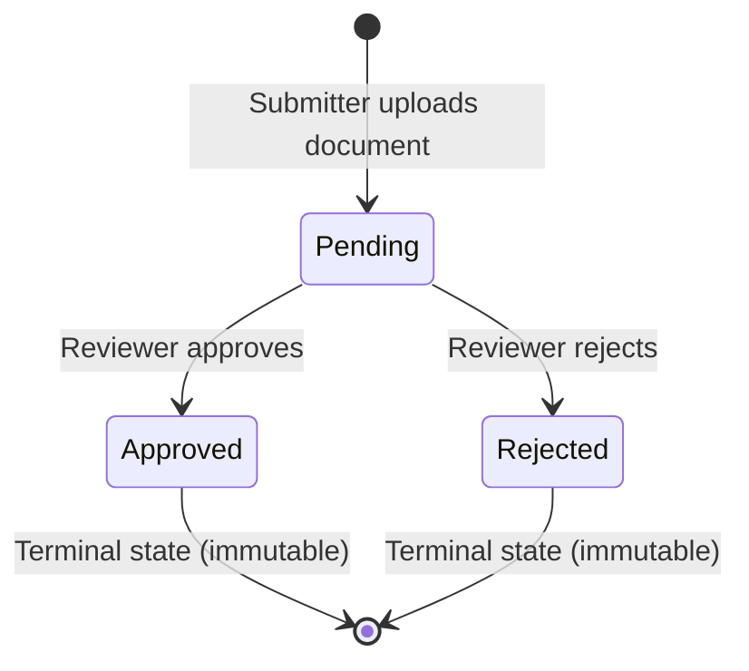

# Document Approval Workflow

A minimal, production-minded **Document Approval Workflow** built with a **Django REST Framework** backend and a **React (Vite)** frontend. The application enables submitters to upload documents for review and track their status with instant feedback, while reviewers can inspect, approve, or reject submissions through a dedicated dashboard.

---

## 🌐 Live Application
- **Frontend App:** [https://document-approval-workflow.onrender.com](https://document-approval-workflow.onrender.com)
- **Backend API:** [https://document-workflow-api.onrender.com](https://document-workflow-api.onrender.com)
- **Video Walkthrough:** [Loom Video (5 mins)](https://www.loom.com/share/f27a00d70db2407da2719fbb548678e5)

---

## 🚀 Quick Start & Local Setup

### Prerequisites
- **Python 3.10+**
- **Node.js 18+** & **npm**

---

### 1. Backend Setup (Django)

```bash
# 1. From the project root, create and activate the virtual environment
# Windows:
python -m venv .venv
.venv\Scripts\activate

# macOS / Linux:
# python3 -m venv .venv
# source .venv/bin/activate

# 2. Navigate to backend directory and install dependencies
cd backend
pip install -r requirements.txt

# (Optional) Environment Configuration
# By default, the application runs zero-config on SQLite with sensible defaults.
# If you prefer PostgreSQL, copy .env.example to .env and configure DB credentials:
# cp .env.example .env

# 3. Run database migrations (initializes DB and pre-seeds initial demo users)
python manage.py migrate

# 4. Start the Django development server (runs at http://127.0.0.1:8000)
python manage.py runserver
```

---

### 2. Frontend Setup (React + Vite)

In a separate terminal:

```bash
# Navigate to frontend directory
cd frontend

# Install dependencies
npm install

# Start Vite dev server (runs at http://localhost:5173 with proxy to backend :8000)
npm run dev
```

Visit **`http://localhost:5173`** in your browser.

---

### 👥 Demo Credentials

The initial data migration (`0002_create_demo_users`) pre-seeds two ready-to-use accounts. The login screen also features **1-click quick-fill buttons** for frictionless evaluation:

| Role | Username | Password | Permissions & Views |
| :--- | :--- | :--- | :--- |
| **Submitter** | `jagveer.chauhan` | `123456` | Uploads documents, views personal submission history, tracks submission review status. |
| **Reviewer** | `rahul.chauhan` | `123456` | Views company-wide submission queue, reviews documents, approves/rejects pending items. |

---

## 🧪 Test Execution (Single Command)

In accordance with the assessment requirements, the entire test suite (both backend and frontend) can be executed with a **single unified command**:

### Cross-Platform (Windows / macOS / Linux)
```bash
python run_tests.py
```

### Platform-Specific Scripts
- **Windows:** `.\run_tests.bat`
- **macOS / Linux:** `./run_tests.sh`

### Individual Test Commands
- **Backend Tests (41 tests):**
  ```bash
  cd backend && python manage.py test submissions accounts
  ```
- **Frontend Tests (10 tests):**
  ```bash
  cd frontend && npm run test
  ```

### What the Test Suites Cover:
- **Backend (`42 tests`):**
  - Submitter document upload with title, description, and multipart file attachment.
  - File validation: Content-Type MIME header enforcement (PDF, DOCX, JPG, PNG) and 10 MB size limits.
  - Role-based visibility: Submitters cannot view other submitters' documents (IDOR prevention).
  - Reviewer workflow: Approving and rejecting pending documents with audit timestamps.
  - State machine invariants: Re-reviewing already approved or rejected documents returns `400 Bad Request`.
  - Permission checks: Submitters attempting to review documents return `403 Forbidden` via `IsReviewer` permission class.
  - Authentication: JWT issuance (access and refresh tokens), Bearer header authorization, and token refresh.
- **Frontend (`10 tests`):**
  - `LoginPage` (3 tests): Form rendering, required credentials validation, demo user quick-fill population.
  - `UploadModal` (4 tests): Modal visibility states, required title validation, required file selection validation.
  - `ReviewerDashboard` (3 tests): Queue rendering, approval action triggering, and status filter switching.

---

## 📐 Architecture & API Design

### REST API Endpoints

| Method | Endpoint | Auth Required | Permitted Roles | Description |
| :--- | :--- | :--- | :--- | :--- |
| `POST` | `/api/auth/login/` | No | Any | Authenticates credentials and returns JWT `access` and `refresh` tokens. |
| `POST` | `/api/auth/logout/` | Yes | Authenticated | Clears client tokens and performs logout. |
| `GET` | `/api/auth/me/` | Yes | Authenticated | Returns currently authenticated user details and role. |
| `POST` | `/api/auth/token/refresh/` | No | Any | Refreshes an expired access token using a valid refresh token. |
| `GET` | `/api/submissions/` | Yes | Authenticated | List submissions (Submitter: own only; Reviewer: all). |
| `POST` | `/api/submissions/` | Yes | Submitter only | Creates a new document submission (`multipart/form-data`). |
| `GET` | `/api/submissions/:id/` | Yes | Authenticated | Fetches detail of a single submission (scoped by role). |
| `PATCH` | `/api/submissions/:id/review/` | Yes | Reviewer only | Approves or rejects a pending submission. |

---

### Request & Response Schemas

#### 1. Create Document Submission (`POST /api/submissions/`)
- **Headers:** `Content-Type: multipart/form-data`
- **Payload:**
  - `title` (string, required): Document title (e.g., `"Q3 Financial Report"`)
  - `description` (string, optional): Context or notes
  - `file` (binary file, required): PDF, DOCX, JPG, or PNG (max 10 MB)
- **Response (`201 Created`):**
  ```json
  {
    "id": 1,
    "title": "Q3 Financial Report",
    "description": "Audited balance sheet and summary",
    "file": "/media/submissions/q3_report.pdf",
    "submitted_by": "jagveer.chauhan",
    "status": "pending",
    "reviewed_by": null,
    "reviewed_at": null,
    "created_at": "2026-09-30T10:15:00Z",
    "updated_at": "2026-09-30T10:15:00Z"
  }
  ```

#### 2. Review Submission (`PATCH /api/submissions/:id/review/`)
- **Headers:** `Content-Type: application/json`
- **Payload:**
  ```json
  {
    "status": "approved"
  }
  ```
- **Response (`200 OK`):**
  ```json
  {
    "id": 1,
    "title": "Q3 Financial Report",
    "description": "Audited balance sheet and summary",
    "file": "/media/submissions/q3_report.pdf",
    "submitted_by": "jagveer.chauhan",
    "status": "approved",
    "reviewed_by": "rahul.chauhan",
    "reviewed_at": "2026-09-30T10:45:00Z",
    "created_at": "2026-09-30T10:15:00Z",
    "updated_at": "2026-09-30T10:45:00Z"
  }
  ```
- **Error Response (`400 Bad Request` if already reviewed):**
  ```json
  {
    "detail": "Document has already been approved and cannot be reviewed again."
  }
  ```

---

## 🔄 State Machine & Workflow Transitions



### State Transition Invariants:
1. **Initial State:** Every uploaded document starts strictly in `pending`.
2. **Terminal Transitions:** Once a document moves to `approved` or `rejected`, its status becomes **immutable**. Any subsequent attempt to re-review triggers a `400 Bad Request`.
3. **Audit Trail:** Every transition records the reviewing user (`reviewed_by`) and a UTC timestamp (`reviewed_at`).
4. **Separation of Duties:** Submitters are programmatically prevented from reviewing documents at the view level via custom DRF permission classes (`IsReviewer`) and routing controls.

---

## ⚖️ Major Decisions & Time-Budget Trade-Offs

Given the **2-hour time constraint**, architectural decisions were made to deliver a robust, secure, and fully verified workflow application while avoiding over-engineering. The table below explicitly details **what was used**, **what alternatives were considered**, and the **time-budget rationale**:

| Area | What We Used (Current Implementation) | What We Could Have Used (Alternative) | 2-Hour Time Budget Trade-Off Rationale |
| :--- | :--- | :--- | :--- |
| **Database & File Storage** | SQLite (zero-config default) + local filesystem media storage (with pluggable PostgreSQL support in settings) | Managed PostgreSQL instance + Cloud Object Storage (AWS S3 / GCS) with time-limited pre-signed URLs | Provisioning external cloud buckets, IAM credentials, and database servers adds setup friction for evaluators. SQLite + local storage runs immediately out-of-the-box with zero setup steps. |
| **Authentication & Authorization** | JWT (JSON Web Tokens via `djangorestframework-simplejwt`) with Bearer token authorization | Cookie-based session authentication with CSRF tokens, or complex OAuth 2.0 / SSO providers | Decoupled modern frontend (React/Vite) and backend API architectures operate across independent origins. Session cookies introduce third-party cookie blocking issues across domains. JWT Bearer tokens provide stateless, cross-origin compatibility without CSRF overhead while respecting the 2-hour assessment boundary. |
| **UI & Styling** | Handcrafted Vanilla CSS with CSS variable design system tokens | Heavy UI component libraries (MUI, Ant Design, Chakra) or Tailwind CSS build pipelines | Third-party UI libraries require extensive theme overrides, introduce dependency bloat, and risk styling conflicts. Vanilla CSS with custom tokens gave 100% control over responsive layouts, glassmorphism, and status badges with zero build friction. |
| **Testing Strategy** | Deep integration tests on backend API (41 tests) + focused React component tests (10 tests) | Full End-to-End (E2E) browser automation using Cypress or Playwright | Setting up and maintaining E2E browser automation requires spinning up multiple servers, configuring browser binaries, and debugging fragile wait-states. Prioritizing backend integration tests secured all core authorization, file validation, and state machine rules deterministically in seconds. |
| **Status Synchronization** | On-mount API fetch with manual refresh button and optimistic UI state updates | Real-time WebSockets (Django Channels + Redis) or Server-Sent Events (SSE) / short polling | WebSockets require configuring ASGI, Redis message brokers, and complex client-side reconnection logic. A clean dashboard with an on-demand refresh button and immediate upload feedback solved the workflow requirements within the time boundary. |
| **Document Processing** | Synchronous request-time validation (MIME header checks and 10 MB size limits) | Asynchronous task queues (Celery + Redis) for virus scanning, PDF thumbnail generation, and email alerts | Running Celery workers and message queues requires multi-process orchestration that complicates local evaluation. Synchronous validation delivers immediate, actionable error responses directly to the user. |

---

## 🤖 AI Tools Disclosure

In alignment with transparent development practices:
- **Tools Used:** Google Antigravity & OpenAI ChatGPT.
- **How They Were Used:**
  - Scaffolding project structure and initial boilerplates for Django and React.
  - Formulating edge-case test scenarios and test case writing for backend and frontend test suites.
  - Generating and formatting the comprehensive technical `README.md` documentation.
- **What Was Manually Engineered:**
  - Core domain models, state machine invariants, and terminal transition validation guards.
  - Role-based queryset scoping (Submitters restricted to own documents, Reviewers to company-wide queue) and custom DRF permission enforcement (`IsReviewer`).
  - Cross-platform unified test runners (`run_tests.py`, `run_tests.bat`, `run_tests.sh`) and live cloud deployment orchestration on Render.

---

## 📹 Video Walkthrough

A 5-minute video walkthrough explaining the architecture, demonstrating live document upload/approval, and discussing technical tradeoffs:
- **Walkthrough Link:** [Loom Video Walkthrough](https://www.loom.com/share/f27a00d70db2407da2719fbb548678e5)

---

## 🏭 Production-Ready Enhancements

For a scalable, enterprise-grade deployment, the following enhancements would be added:
1. **Cloud Object Storage:** Transition file storage from local disk to **AWS S3 / Google Cloud Storage** using time-limited pre-signed URLs for secure document downloads.
2. **Database Scaling & Pooling:** Add production connection pooling (`pgbouncer`) and read replicas for high-concurrency enterprise workloads.
3. **Async Processing & Notifications:** Integrate **Celery + Redis** to handle asynchronous file virus scanning, PDF thumbnail generation, and automated email/Slack alerts when documents are submitted or reviewed.
4. **Audit Logging & Activity History:** Add a dedicated `SubmissionAuditLog` model to track full version history, comments, and reviewer remarks.
5. **Containerization & CI/CD:** Add `Dockerfile` and `docker-compose.yml` along with GitHub Actions workflows for automated linting, test execution, and deployment to AWS ECS or Render.
